# xPPC

## Aplicação para geração automatizada de Projetos Pedagógicos de Curso do IFPE

Ferramenta feita em Java para automação de Projetos Pedagógicos de Curso (PPC) no IFPE. Utiliza formulários para receber dados do usuário, compilar e gerar um documento padronizado.

## Identidade visual

## Publico alvo

Coordenadores de curso, diretores de ensino, membros de Núcleos Docentes Estruturantes (NDE), gestores acadêmicos pertencentes aos campi do IFPE, comissões de criação e revisão de PPCs.

## Capturas de tela

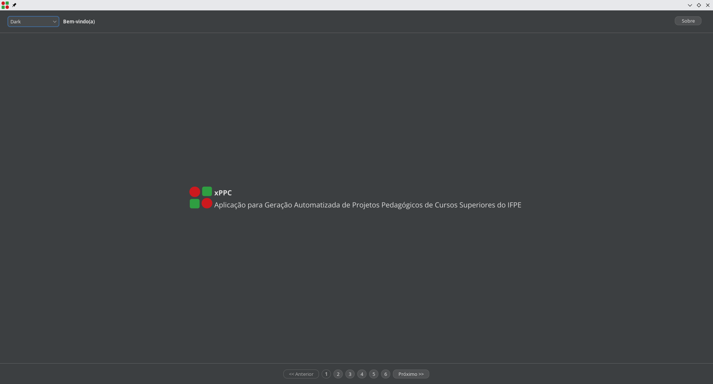
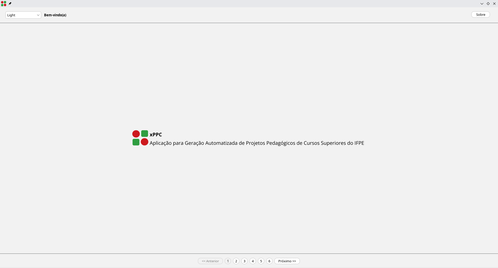
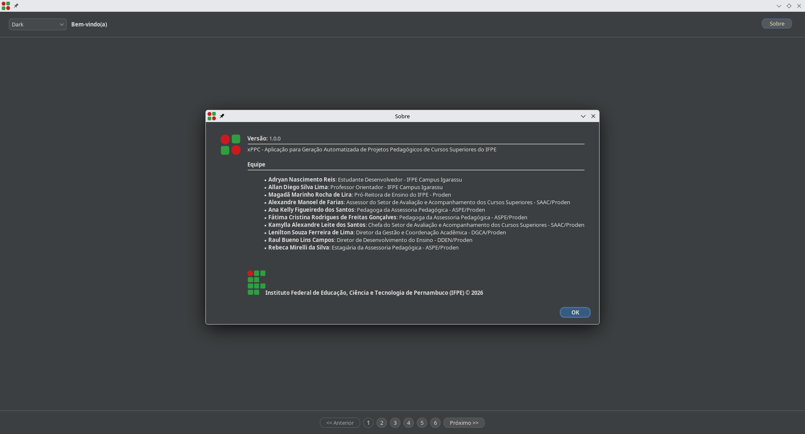
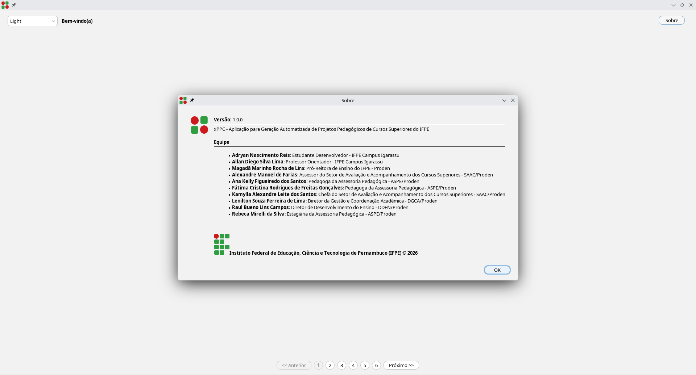
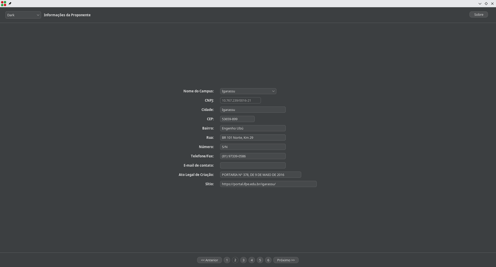
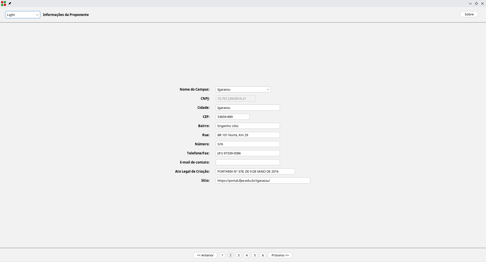
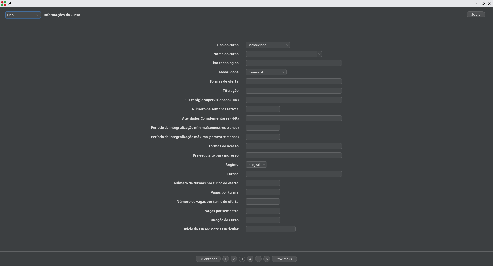
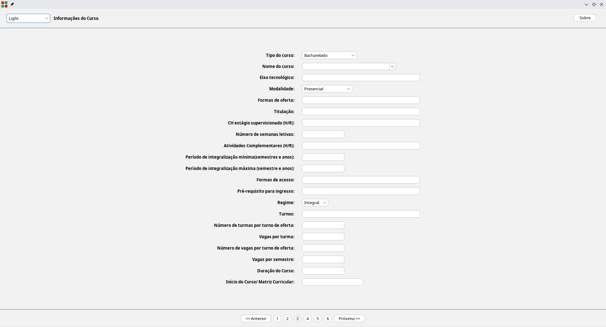
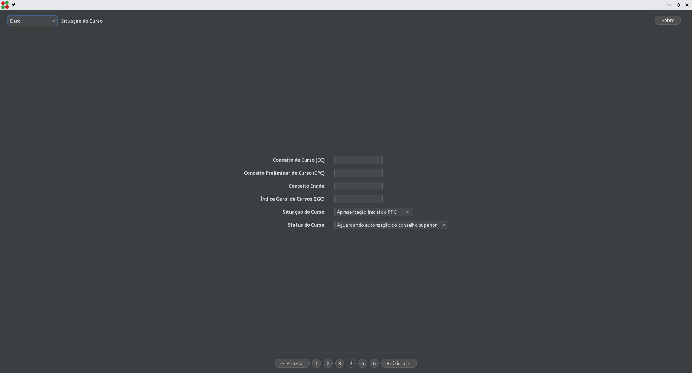
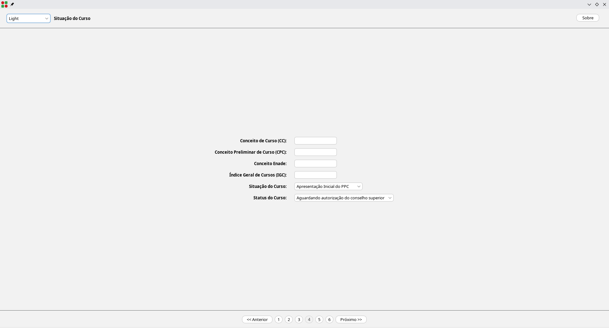
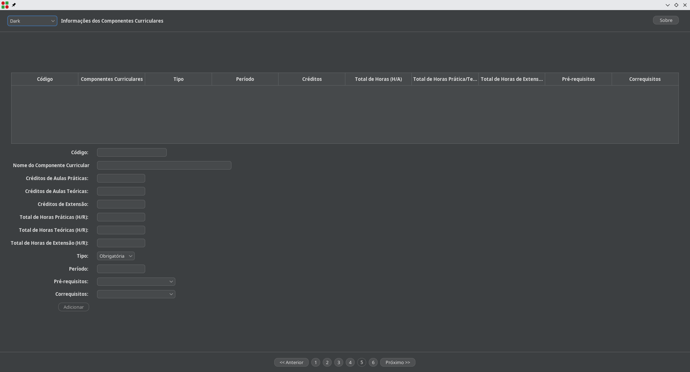
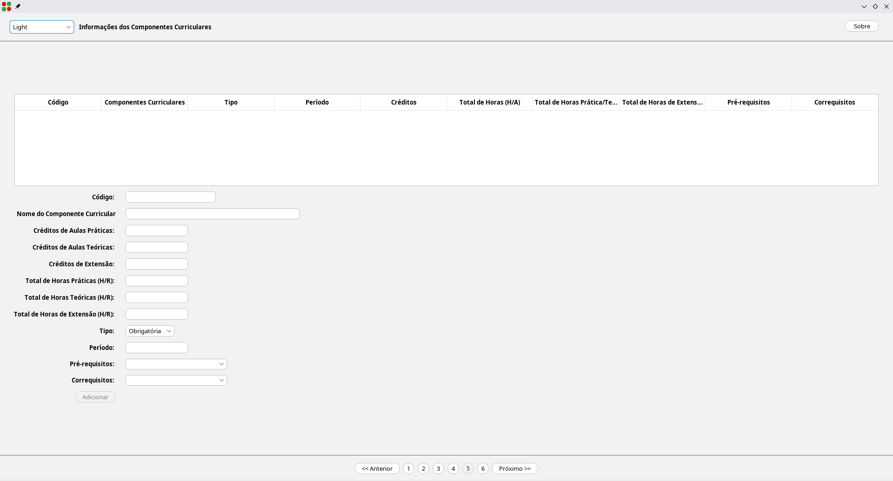
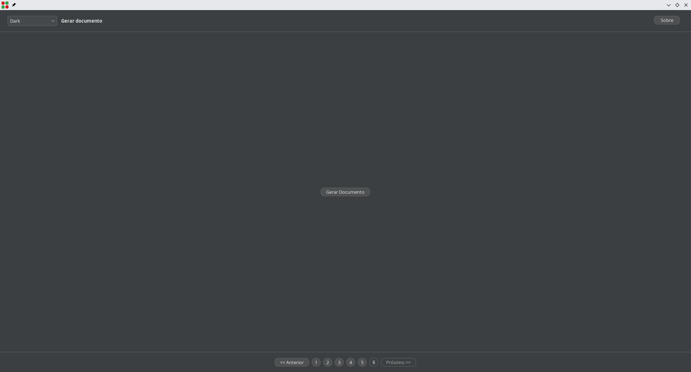
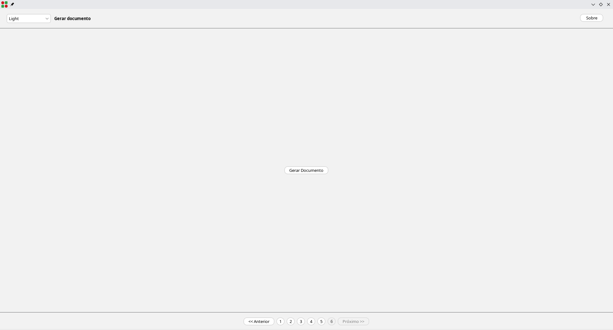

